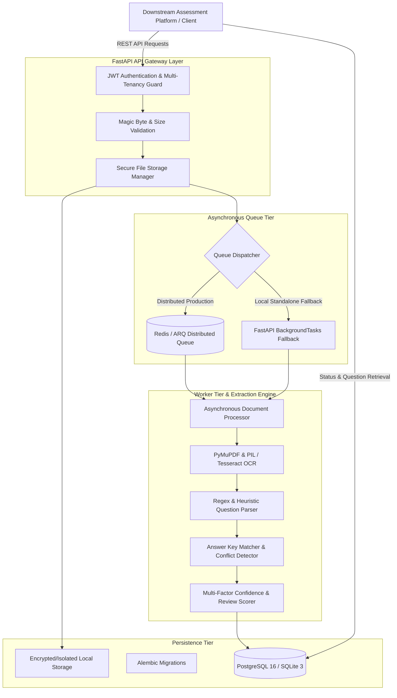
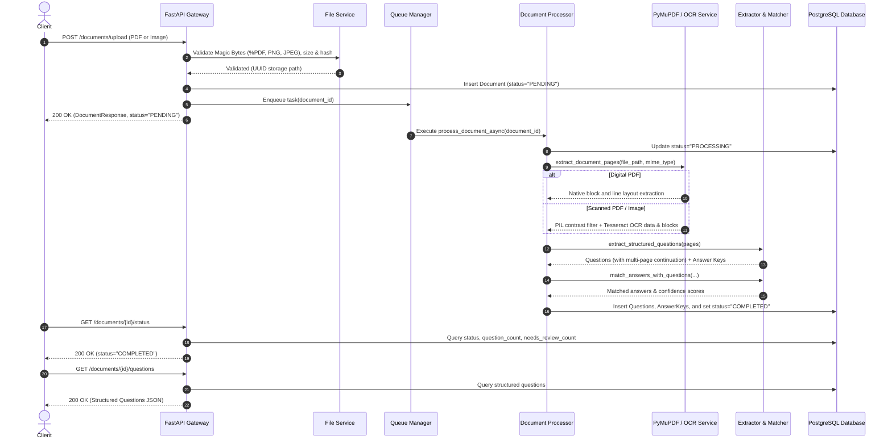
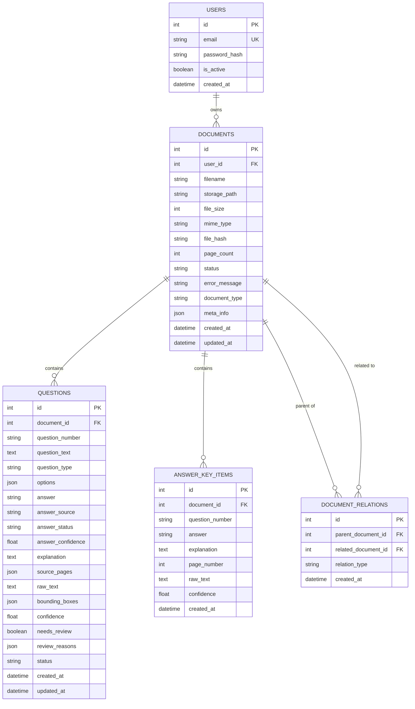

# Pragati Bharati — Document Intelligence & Question Extraction Architecture

## 1. System Overview

The **Pragati Bharati Document Intelligence Service** is an enterprise-ready, asynchronous microservice designed to ingest examination papers and question banks in varied formats (digital PDFs, scanned PDFs, JPG, and PNG images) and extract high-fidelity, structured, machine-readable questions and associated answer keys.

---

## 2. Document Processing Pipeline

The ingestion and extraction workflow follows a multi-stage deterministic pipeline:

---

## 3. Technology Choices & Rationale

| Component | Technology | Rationale |
| :--- | :--- | :--- |
| **Web Framework** | **FastAPI 0.115** | High-performance asynchronous ASGI framework, native OpenAPI/Swagger generation, Pydantic v2 data validation, and built-in background tasks. |
| **ORM & Persistence** | **SQLAlchemy 2.0 Async + asyncpg / aiosqlite** | Fully asynchronous relational mapping with clean migration support via Alembic. PostgreSQL for enterprise clustering; SQLite for seamless local execution. |
| **PDF Extraction** | **PyMuPDF (`fitz`)** | 10x faster than PyPDF/pdfminer; extracts high-fidelity bounding boxes, font weights, and layout positions. Native support for rasterizing scanned pages. |
| **Image & OCR** | **Pillow + Tesseract OCR (pytesseract)** | Resilient multi-platform OCR with image preprocessing (sharpening, contrast boost, deskewing). Gracefully falls back when system binaries are absent. |
| **Asynchronous Engine** | **ARQ + Redis with FastAPI BackgroundTasks Fallback** | Distributed job queue with non-blocking polling and task timeouts. The dual-path queue dispatcher allows running tests locally with zero dependencies while supporting horizontally scalable workers in production. |
| **Security & Auth** | **JWT (python-jose) + bcrypt (passlib)** | Stateless authentication, expiring bearer tokens, salted password hashing, and tenancy-scoped database queries. |

---

## 4. Storage & Relational Schema Design

The database schema enforces data integrity, cascade deletion, and multi-tenant isolation:

---

## 5. Question Extraction & Multi-Page Stitching Strategy

### A. Question Stem Identification
The extractor utilizes a priority regex cascading matcher capable of recognizing arbitrary numbering styles:
1. `Q1.`, `Q.1`, `Question 1:`, `Question No. 1`
2. `1.`, `12.`, `101.`
3. `1)`, `2)`
4. `[1]`, `(1)`
5. `1 - Question Stem`

### B. Cross-Page Continuation (Multi-Page Spanning)
In printed examination papers, questions frequently start on page $N$ and have their sentence or options spill over onto page $N+1$.
- **Detection**: The extractor tracks the state of the active question. If page $N$ terminates without encountering a new question start pattern, subsequent lines on page $N+1$ are appended to the active question.
- **Provenance**: The `source_pages` array records all page indices involved (e.g., `[1, 2]`).
- **Review Flagging**: Cross-page questions are flagged with `split_across_pages` to allow human reviewers to confirm layout boundary transitions.

### C. Options Parsing
Options formatted as `(A)`, `[A]`, `A.`, or `A)` are extracted with exact key and text separation. Multiple options appearing on the same line (e.g. `(A) Red   (B) Blue`) are unpacked into discrete structured JSON items.

---

## 6. Answer Key Association Architecture

Answers can originate from three distinct patterns:
1. **Inline Answers**: Stated directly below or beside the question (`Ans: B`, `Answer: Option C`).
2. **End-of-Document Answer Key**: Distinct section header (`ANSWER KEY`) at the conclusion of the examination paper.
3. **Separate Linked Document**: When an Answer Key PDF is uploaded independently, it is linked to the Question Paper via `POST /documents/{id}/link`.

### Conflict Detection & Uncertainty Handling
Rather than guessing or silently assigning inaccurate answers:
- If an inline answer agrees with the answer key, `answer_status = "matched"` and `answer_confidence = 1.0`.
- If an inline answer contradicts the answer key, `answer_status = "uncertain"`, `needs_review = True`, and `review_reasons = ["conflicting_answers_inline_X_vs_key_Y"]`.
- If the answer key references an option that does not exist in the question's option set (e.g. key specifies "E" but options only span A–D), the question is flagged with `answer_status = "uncertain"` and `answer_option_mismatch_with_options_list`.

---

## 7. Confidence Scoring & Review Rubric

Each question is assigned a composite reliability confidence score $C \in [0.1, 1.0]$:

$$\text{Confidence} = 1.0 - \sum \text{Penalties}$$

| Factor | Condition | Penalty | Review Reason Code |
| :--- | :--- | :--- | :--- |
| **OCR Quality** | OCR block confidence $< 70\%$ | $-0.25$ | `low_ocr_confidence` |
| **Stem Integrity** | Length $< 15$ characters | $-0.30$ | `very_short_question_stem` |
| **Option Completeness** | Missing intermediate keys (e.g., A, B, D without C) | $-0.20$ | `discontinuous_option_keys` |
| **Option Count** | Fewer than 3 options on MCQ | $-0.15$ | `partial_options_count_{N}` |
| **Layout Boundary** | Question spans multiple pages | $-0.05$ | `split_across_pages` |
| **Sequence Order** | Numbering skip (e.g., Q1 then Q5) | $-0.10$ | `non_sequential_number_expected_{X}_got_{Y}` |
| **Answer Match** | No answer found across inline or key sources | $-0.05$ | `unmatched_answer_key` |

A question is flagged with `needs_review: true` whenever:
- Confidence score is below $0.75$.
- Critical anomalies are present (`low_ocr_confidence`, `discontinuous_option_keys`, `very_short_question_stem`, or conflicting answers).

---

## 8. Security Considerations

1. **Magic Byte Verification**: File headers are inspected using binary signatures (`%PDF`, `\x89PNG`, `\xff\xd8\xff`) to reject malicious files masking as valid documents.
2. **Path Traversal Prevention**: Files are stored using cryptographic UUIDs (`{uuid4}_{sanitized_name}`) completely decoupled from client-supplied directory paths.
3. **Multi-Tenant Authorization**: All database queries enforce `user_id == current_user.id`. Users cannot view, modify, or delete resources belonging to another user.
4. **Credential Isolation**: Secrets, JWT keys, and database credentials are strictly managed through environment variables and never committed to version control.

---

## 9. Scalability & Production Readiness

1. **Stateless API Gateway**: The FastAPI service is completely stateless and can be scaled horizontally behind an AWS ALB, NGINX, or Cloudflare reverse proxy.
2. **Independent Worker Scaling**: Background document processing is decoupled into ARQ worker instances. Worker replicas can be scaled up dynamically based on Redis queue depth.
3. **Connection Pooling**: SQLAlchemy AsyncEngine utilizes connection pooling with automatic reconnection and recycling.
4. **Zero-Downtime Database Migrations**: Schema evolution is fully managed by Alembic.

---

## 10. Trade-Offs and Known Limitations

- **Complex Handwritten Text**: Highly degraded handwritten notes without clear character segmentation require fine-tuned vision-language models (e.g., Gemini Vision / GPT-4o). The system is architecturally prepared with modular extractors to swap in external LLM APIs via configuration (`OCR_PROVIDER=gemini`).
- **Nested Sub-Questions**: Extremely complex hierarchical questions (e.g., Question 1 containing subparts a, b, c which themselves contain MCQs) are currently flattened to preserve question stem context.
